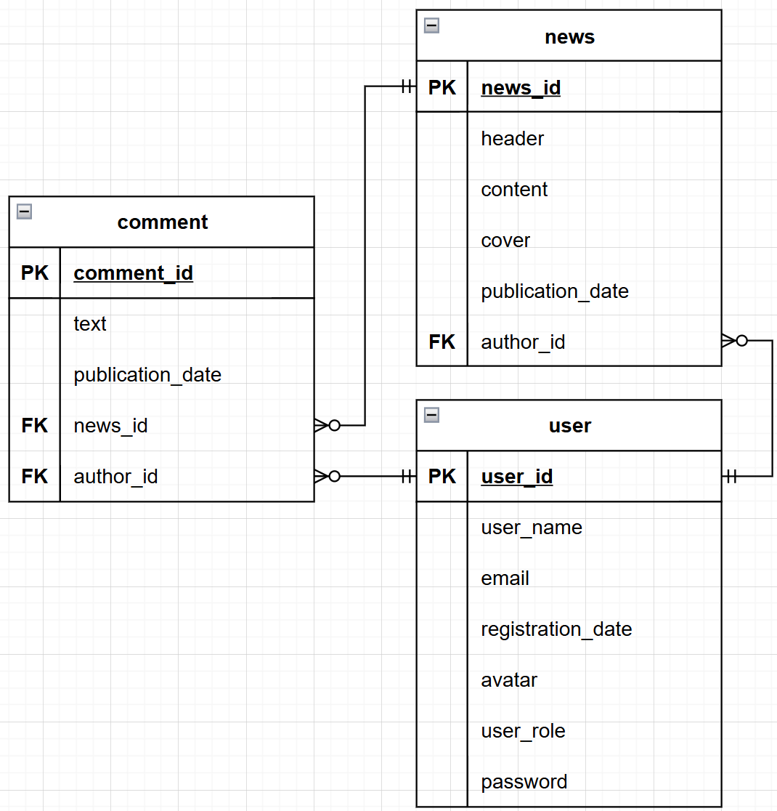

# Веб сервис сервис

## Описание сервиса

При помощи новостного сервиса можно: 
- регистрировать, изменять, удалять и получать пользователей
- авторизовывать пользователей (то есть, создавать для них сессии), получать и удалять сессии и обновлять их при помощи refresh токенов

Также в данном сервисе сессии целиком храняться в СУБД Redis класса NoSQL. \
TTL (время жизни) сессий равно времени жизни соответствующего refresh токена.

## Визуализация моделей сущностей и их связей

## Шаги для запуска сервиса

1. Создать в корне проекта файл .env со строками по следующему образцу:

    POSTGRES_USER="postgres" \
    POSTGRES_PASSWORD="123" \
    POSTGRES_HOST="localhost" \
    POSTGRES_DB="news_service" \
    POSTGRES_PORT="5433" \
    REDIS_HOST="localhost" \
    REDIS_PORT="6380" \
    JWT_SECRET_KEY="my_secret_key" \
    JWT_LIFETIME_MINUTES="1" \
    REFRESH_TOKEN_LIFETIME_DAYS="1" 

2. Создать и активировать виртуальное окружение:

    python -m venv .venv \
    .venv\Scripts\Activate.ps1

3. Установить необходимые зависимости:

    pip install -r requirements.txt

4. Применить миграции

    Команда для применения всех существующих миграций: \
    alembic upgrade head

    Для отката последней миграции используйте команду: \
    alembic downgrade -1

5. Запустить Docker

    Для этого, например, можно скачать Docker Desktop (для Windows)

5. Запустить базы данных, backend, frontend приложения при помощи Docker файла 

    docker-compose up

## Тестирование веб-сервиса

После запуска приложения описание каждого из методов CRUD для каждой сущности можно посмотреть с помощью инструмента **Swagger** по адресу http://127.0.0.1:8000/docs. 

Также можно протестировать работу backend при помощи инструмента **Postman**.

Посмотреть, как работает frontend приложения, можно по адресу http://localhost:5173/.